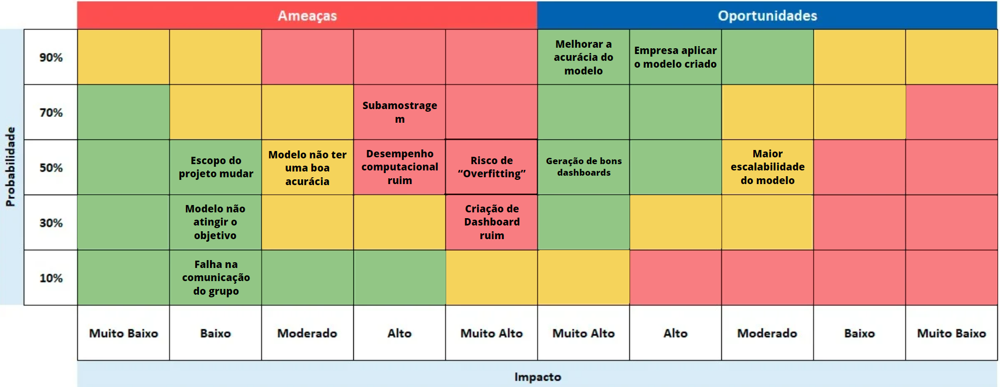

# Desenvolvimento das Telas

## Introdução

&emsp;Durante a segunda sprint do projeto, a equipe It-Cross desenvolveu uma interface gráfica para proporcionar ao parceiro uma melhor visualização dos dados do modelo preditivo. Seguindo o que foi confeccionado durante a etapa de wireframe, a interface do usuário (UI) foi desenvolvida utilizando o React, que proporcionou uma experiência de desenvolvimento mais eficiente e flexível. Na parte de estilização, a equipe optou por utilizar o framework de CSS chamado Tailwind, que proporcionou a personalização das páginas.

## Tecnologias Utilizadas

### React

&emsp;React é uma biblioteca JavaScript que permite a construção de interfaces de usuário de maneira declarativa, simplificando a criação de componentes interativos e reutilizáveis, tornando o desenvolvimento de aplicações complexas mais eficiente. Ele também é muito utilizado para a criação de aplicações web e móveis. 

### Tailwind CSS

&emsp;Tailwind CSS é um framework que adota uma abordagem utilitária para a estilização, onde os desenvolvedores podem aplicar classes utilitárias diretamente aos elementos HTML, o que torna a manutenção de estilos mais consistente e acelera o desenvolvimento.

## Interface do Usuário

&emsp;Atualmente, foram desenvolvidas trêS páginas para mostrar de forma organizada e limpa os dados resultantes do modelo. Essas páginas são consecutivamente a de predição do modelo, histórico de carros na produção e uma página de análise derivada da página de histórico onde mostra-se detalhadamente cada tipo de falha ocorrida em cada checkpoint e durante a rodagem. A seguir, você poderá ver o desenvolvimento detalhado de cada página:

### Tela de predição do modelo

&emsp;Na tela de predição do modelo, você pode visualizar o modelo do carro e suas características inserindo o KNR do carro na caixa de texto onde está escrito "Insira o KNR". Após inserir o KNR, clique no botão "Ok". As informações do carro e suas características serão exibidas em uma tabela, com o resultado aparecendo logo abaixo dessa tabela.

<p style={{textAlign: 'center'}}>Figura 1 - Tela de predição </p>



<h6 align="center"> Fonte: Elaboração Grupo IT-Cross </h6>


### Implementação em React
```
'use client';

import { useState } from 'react';
import BaseButton from "@/components/baseButton";
import InputBar from "@/components/inputBar";
import IconHome from "@/../public/icone_home.svg";
import { columns } from "@/components/columns";
import { DataTable } from "@/components/ui/data-table";
import BaseCard from '@/components/baseCard';

export default function PredictionPage() {
  const [data, setData] = useState(null);
  const [showTable, setShowTable] = useState(false);
  const [inputValue, setInputValue] = useState('');
  const [predictionTextOutput, setPredictionTextOutput] = useState('');
  const [cardColor, setCardColor] = useState('bg-blue-500');  // Estado para a cor do BaseCard

  const handleButtonClick = async () => {
    console.log("Valor de KNR inserido: " + inputValue);

    const response = await fetch(
      "http://127.0.0.1:8000/predict/", {
        method: "POST",
        body: JSON.stringify({
          knr: inputValue
        }),
        headers: {
          'Content-type': 'application/json; charset=UTF-8'
        }
      });

    if (!response.ok) {
      console.error("Erro na requisição:", response.statusText);
      return;
    }

    const responseJson = await response.json();
    console.log(responseJson);

    responseJson['KNR'] = inputValue;
    responseJson['model'] = 'It-Cross';

    console.log("Resultado da predição: " + responseJson['prediction']);

    setData([responseJson]);
    setShowTable(true);

    // Atualiza o estado com base na predição
    if (responseJson['prediction'] == 1) {
      setPredictionTextOutput("Suscetível a teste");
      setCardColor('bg-red-600');  // Define a cor verde para resultado positivo
    } else {
      setPredictionTextOutput("NÃO suscetível a teste");
      setCardColor('bg-green-600');  // Define a cor vermelha para resultado negativo
    }
  };

  const handleInputChange = (event) => {
    setInputValue(event.target.value);
  };

  return (
    <main className="flex min-h-screen flex-col justify-between p-10">

      <div className="h-12 w-full flex justify-evenly mb-6">
        <BaseButton icon={IconHome} />
        <InputBar onChange={handleInputChange} />
        <BaseButton text='Ok' onClick={handleButtonClick} />
      </div>

      {showTable && data && <DataTable columns={columns} data={data} />}

      {showTable && data && (
        <div className="flex justify-center items-center mt-6">
          <BaseCard text={predictionTextOutput} color={cardColor} />  {/* Passa a cor como prop */}
        </div>
      )}
    </main>
  );
} 
```

### Tela de Histórico

&emsp;A págine de histórico exibe todos os dados e resultados de predição relacionados aos KNRs analisados. Esses dados são apresentados em uma tabela para facilitar a visualização das informações. A linha dos títulos das colunas é fixa, enquanto as demais linhas são scrolláveis para acomodar a grande quantidade de dados. No topo da página, há dois botões: um que redireciona para a homepage e outro para a página de análise.

<p style={{textAlign: 'center'}}>Figura 2 - Tela de histórico </p>


<h6 align="center"> Fonte: Elaboração Grupo IT-Cross </h6>

### Implementação em React
```import React from 'react';
import BaseButton from "@/components/baseButton"; 
import IconHome from "@/../public/icone_home.svg";
import "./style.css";

function HistoryPage() {
  const renderTableRow = () => (
    <tr className="table-row">
      <td className="border px-4 py-2">KNR Example</td>
      <td className="border px-4 py-2">
        <table className="w-full bg-white">
          <thead>
            <tr className="table-header">
              <th className="border px-2 py-1 text-left">ZP1</th>
              <th className="border px-2 py-1 text-left">ZP2</th>
              <th className="border px-2 py-1 text-left">ZP3</th>
              <th className="border px-2 py-1 text-left">ZP4</th>
              <th className="border px-2 py-1 text-left">ZP5</th>
              <th className="border px-2 py-1 text-left">ZP6</th>
              <th className="border px-2 py-1 text-left">ZP7</th>
              <th className="border px-2 py-1 text-left">ROD</th>
              <th className="border px-2 py-1 text-left">Total</th>
            </tr>
          </thead>
          <tbody>
            <tr>
              <td className="border px-2 py-1 text-left">10</td>
              <td className="border px-2 py-1 text-left">15</td>
              <td className="border px-2 py-1 text-left">20</td>
              <td className="border px-2 py-1 text-left">12</td>
              <td className="border px-2 py-1 text-left">18</td>
              <td className="border px-2 py-1 text-left">14</td>
              <td className="border px-2 py-1 text-left">11</td>
              <td className="border px-2 py-1 text-left">22</td>
              <td className="border px-2 py-1 text-left">122</td>
            </tr>
          </tbody>
        </table>
      </td>
      <td className="border px-4 py-2">Predição Example</td>
      <td className="border px-4 py-2">Status Example</td>
    </tr>
  );

  return (
    <div className="min-h-screen bg-gray-100 p-4">
      {/* Header with Home Icon and Title */}
      <div className="flex items-center mb-4">
        <BaseButton text="Home" icon={IconHome} className="button-gray" />
        <a href="/analysis" className="ml-4 text-gray-700 font-semibold text-lg">Análise</a>
      </div>

      {/* Main Table */}
      <div className="overflow-x-auto">
        <table className="min-w-full bg-gray-200">
          <thead>
            <tr className="table-header">
              <th className="border px-4 py-2 text-left">KNR</th>
              <th className="border px-4 py-2 text-left">Tempo</th>
              <th className="border px-4 py-2 text-left">Predição</th>
              <th className="border px-4 py-2 text-left">Status</th>
            </tr>
          </thead>
          <tbody>
            {renderTableRow()}
            {renderTableRow()}
            {/* Adicione mais linhas conforme necessário */}
          </tbody>
        </table>
      </div>
    </div>
  );
}

export default HistoryPage;
```
### Tela de Análise

&emsp;A página de análise serve como um dashboard da solução, exibindo cards para cada checkpoint da linha de produção de carros. Cada card contém um gráfico de barras horizontais que mostra a frequência de falhas por tipo em cada checkpoint. No canto superior direito, é exibida a precisão atual do modelo preditivo, auxiliando o gerente de qualidade na tomada de decisões, como focar em checkpoints com mais falhas, e na avaliação da confiabilidade das predições.

<p style={{textAlign: 'center'}}>Figura 3 - Tela de análise </p>

!

<h6 align="center"> Fonte: Elaboração Grupo IT-Cross </h6>

### Implementação em React
```import React from 'react';
import BaseButton from "@/components/baseButton"; 
import IconHome from "@/../public/icone_home.svg";
import "./style.css";

function AnalysisPage() {

  const zones = [
    { name: "ZP1", pintura: 80, amassados: 50, painel: 20 },
    { name: "ZP2", pintura: 70, amassados: 60, painel: 30 },
    { name: "ZP3", pintura: 85, amassados: 40, painel: 25 },
    { name: "ZP4", pintura: 60, amassados: 75, painel: 45 },
    { name: "ZP5", pintura: 90, amassados: 55, painel: 35 },
    { name: "ZP6", pintura: 95, amassados: 65, painel: 50 },
    { name: "ZP7", pintura: 50, amassados: 70, painel: 30 },
    { name: "ROD", pintura: 65, amassados: 80, painel: 55 },
  ];

  return (
    <div className="min-h-screen bg-gray-100 p-4">
      <div className="flex justify-between items-center mb-4">
        <div className="flex space-x-2">
          <BaseButton text="Home" icon={IconHome} className="button-gray" />
          <a href="/history" className="bg-gray-300 p-2 rounded-full flex items-center space-x-2">
            <svg
              xmlns="http://www.w3.org/2000/svg"
              fill="none"
              viewBox="0 0 24 24"
              stroke="currentColor"
              className="h-6 w-6"
            >
              <path
                strokeLinecap="round"
                strokeLinejoin="round"
                strokeWidth={2}
                d="M15 19l-7-7 7-7"
              />
            </svg>
            <span>Voltar</span>
          </a>
        </div>
        <div className="text-sm bg-white p-2 rounded shadow-md">
          precisão do modelo: 93%
        </div>
      </div>
      <h1 className="text-xl font-semibold mb-4">Recorrência de falhas:</h1>
      <div className="grid grid-cols-2 md:grid-cols-3 gap-4">
        {zones.map((zone) => (
          <div key={zone.name} className="bg-gray-300 p-4 rounded">
            <h2 className="font-semibold mb-2">{zone.name}</h2>
            <ul className="text-red-500">
              <li>Pintura</li>
              <div className="progress-bar">
                <div className="progress-bar-fill" style={{ width: `${zone.pintura}%` }}></div>
              </div>
              <li>Amassados</li>
              <div className="progress-bar">
                <div className="progress-bar-fill" style={{ width: `${zone.amassados}%` }}></div>
              </div>
              <li>Painel</li>
              <div className="progress-bar">
                <div className="progress-bar-fill" style={{ width: `${zone.painel}%` }}></div>
              </div>
            </ul>
          </div>
        ))}
      </div>
    </div>
  );
}

export default AnalysisPage;
```


