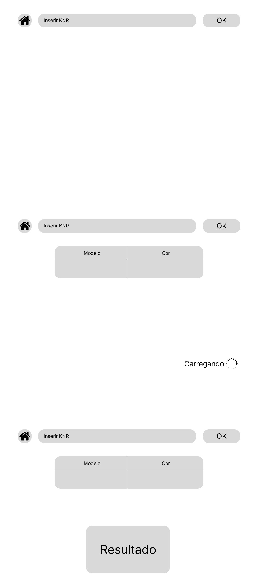

# Wireframe

## Definição

&emsp;Um wireframe é uma versão preliminar de uma interface de usuário. No contexto de desenvolvimento de uma aplicação web, o wireframe apresenta apenas a estrutura de cada página, definindo em qual parte ficará cada conteúdo planejado para a aplicação. Nele, não são inseridas cores, animações ou efeitos visuais, uma vez que o wireframe — em geral — está sujeito a várias alterações na etapa inicial de desenvolvimento e é adequado ter uma estrutura bem estabelecida antes de definir uma estilização.

&emsp;Diante do exposto, fica evidente que a confecção de um wireframe permite a produção de uma solução web melhor guiada e, por isso, a equipe It-Cross optou por desenvolver um wireframe. O wireframe foi desenvolvido através da plataforma Figma (disponível [aqui](https://www.figma.com/design/hYRK6OXtqpqyJJxDbqViPn/Wireframe?node-id=0-1&t=jYTmaFC5FExVFKS9-1)), de modo a considerar o uso da solução por duas personas (descritas em sua [respectiva seção](../../sprint-1/economia-circular/persona.md)), o que será detalhado a seguir:

## Fluxo da persona 1

&emsp;A parte do wireframe que representa o fluxo da persona 1 se concentra em uma única página: a **página de predição**.

<b> Figura 1 - Wireframe do fluxo da persona 1: página de predição</b>

    
    
<b>Fonte:</b> Elaborado pela equipe It-Cross

&emsp;O intuito da página de predição é captar 

