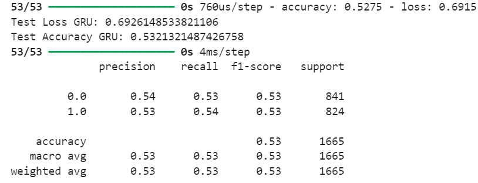
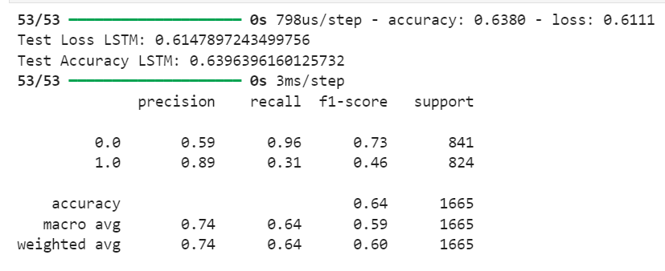

# Aprimoramento do modelo

&emsp;Esta seção aborda como o modelo preditivo desenvolvido pela equipe It-Cross até a sprint 2 foi aprimorado ao longo da sprint 3.

&emsp;Após a sprint review da sprint 2, a equipe foi informada de um detalhe relevante para o projeto: alguns dos checkpoints/halles referidos em algumas das colunas nas bases de dados fornecidas pelo Volkswagen para o desenvolvimento do modelo preditivo contemplam etapas posteriores ao teste de rodagem. Contudo, tais colunas estavam sendo utilizadas no treinamento, validação e teste do modelo desenvolvido, o que vai de desencontro com a proposta de solução da equipe, que envolve predizer qual o tipo ideal de testagem para determinado veículo **antes** do teste de rodagem, sendo incoerente o uso de dados posteriores a essa etapa em sua confecção.

&emsp;As colunas em questão são ``"ROD"``, ``"AGUA"``, ``"ZP8"`` e ``"ZP8R"``. Devido ao desconhecimento dessa informação, o modelo foi desenvolvido de modo a considerar tais colunas, o que conferiu a ele métricas de desempenho erroneamente elevadas em ambos os algoritmos de aprendizagem de máquina utilizados (GRU e LSTM). Após o conhecimento desta informação, as colunas em questões foram "dropadas" (desconsideradas) e a equipe iniciou um novo processo de treino, validação e testagem do modelo com base nos mesmos dois algoritmos, obtendo valores drasticamente reduzidos para as métricas, conforme exibido nas figuras 1 e 2.

Figura 1 - Métricas do modelo após drop das colunas desconsideradas (GRU)

Fonte: Elaborado pela equipe It-Cross

Figura 2 - Métricas do modelo após drop das colunas desconsideradas (LSTM)

Fonte: Elaborado pela equipe It-Cross

