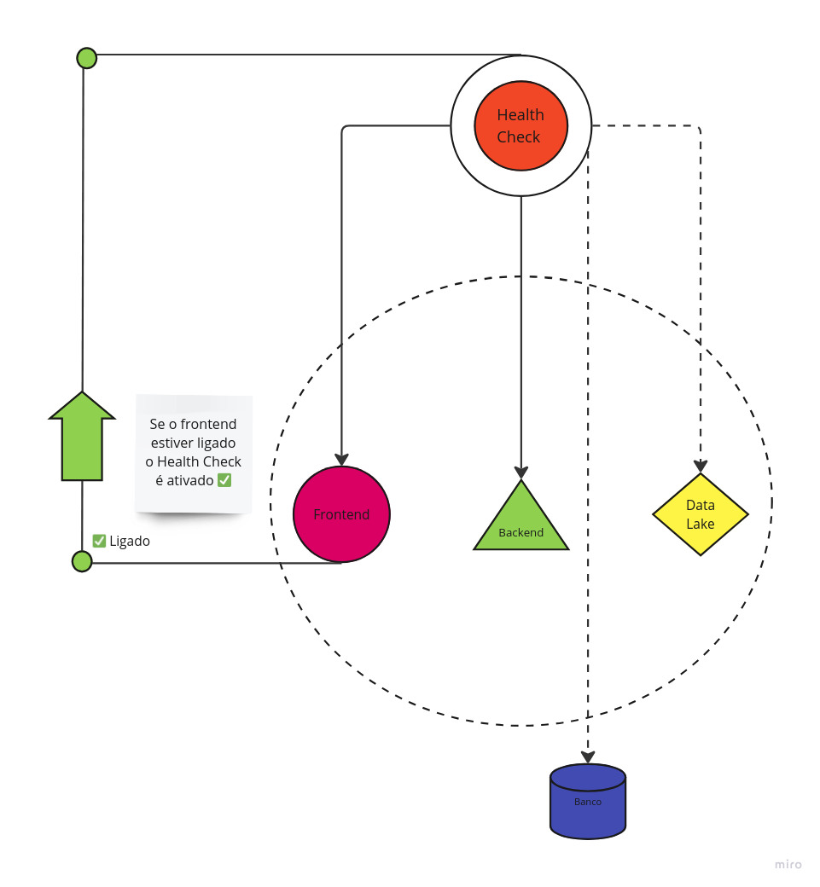

# Implementação de Health Checking para a aplicação

## O que é um sistema de health checking?

## Como isso está sendo aplicado em nossa solução

<p align="center"><b> Figura 1 - Figura arquitetura Health checking</b></p>
<div align="center">
  
  <p><b>Fonte:</b> Elaborado por IT-CROSS</p>
</div>

## Trechos de códigos relevantes

&emsp;Nessa seção iremos explorar a API que fizemos para o monitoramento da aplicação e como o usuário pode visualizar a saúde de cada sistema em questão.

### API & Docker-Compose para controle do sistema de saúde: Backend

&emsp;Primeiro iremos explorar a construção da API e como configuramos no Docker-Compose para que esse sistema funcione e check os serviços monitorados.

```python
```

### Visualização do sistema pelo usuário: Frontend 