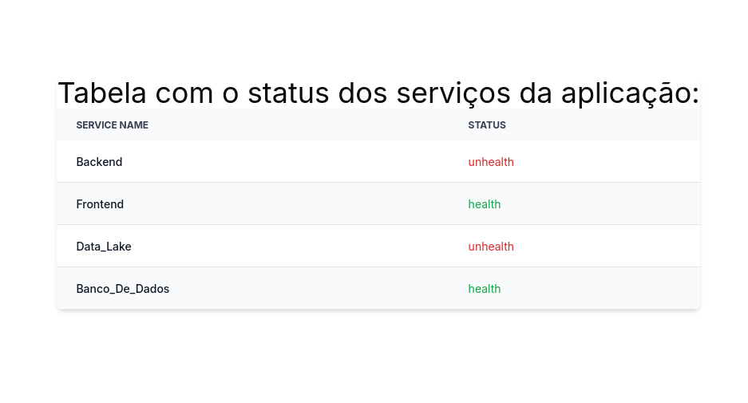

# Implementação de Health Checking para a aplicação

## O que é um sistema de health checking?

&emsp;O health checking é uma prática essencial para monitorar a saúde e o estado de funcionamento de diferentes partes de uma aplicação. Ele permite verificar se os serviços estão operacionais e disponíveis, ajudando a identificar problemas antes que eles impactem o usuário final. Implementar health checking pode incluir verificações periódicas da API, banco de dados, servidores e outros componentes críticos.

## Como isso está sendo aplicado em nossa solução

&emsp;Em nossa solução, o sistema de health checking monitora quatro componentes principais: o backend, o frontend, o banco de dados (hospedado no Supabase) e o data lake, onde está armazenado o modelo de predição. Um serviço central em FastAPI realiza requisições periódicas para verificar se esses sistemas estão funcionando corretamente e retorna uma resposta unificada sobre o status da aplicação. Caso algum dos componentes não esteja acessível, o sistema de health checking notifica detalhadamente sobre o problema identificado.

<p align="center"><b> Figura 1 - Figura arquitetura Health checking</b></p>
<div align="center">
  
  <p><b>Fonte:</b> Elaborado por IT-CROSS</p>
</div>

&emsp;Ao observar a arquitetura acima vemos algumas coisas que devem ser descritas para a melhor interpretação do leitor:

- Linhas potilhadas: Representam os serviços que estão sendo monitorados na aplicação, mas que não são dependências cruciais para o funcionamento do sistema de **health checking**. Ou seja, se algum desses serviços falhar, o sistema de monitoramento da saúde da aplicação continuará ativo.

- Linhas continuas: Representam os serviços que não podem falhar para que o sistema de **health checking** funcione. O **frontend** é o único serviço que precisa estar funcionando, pois sem ele não é possível que o usuário visualize o status dos outros serviços. Sem a interface visual da aplicação em operação, o usuário não consegue verificar se os demais serviços estão rodando corretamente. Por isso, decidimos que, para o sistema de saúde estar ativo, o serviço de **frontend** deve estar no ar.

## Trechos de códigos relevantes

&emsp;Nesta seção, iremos explorar a implementação da API de health check e como ela é configurada no **Docker-Compose** para monitorar os serviços.

### API & Docker-Compose para Controle do Sistema de Saúde: Backend

**1 -**&emsp;Primeiramente, vamos analisar como foi construída a API que realiza o monitoramento dos sistemas de backend e frontend.

```python
from fastapi import APIRouter, status, HTTPException
import httpx

router = APIRouter(tags=["health"])

BACKEND_URL = "http://itcross-backend:3001/health_backend"
FRONTEND_URL = "http://itcross-frontend:3000/api/health"

@router.get("/health", status_code=status.HTTP_200_OK)
async def health_check():
    backend_health = await check_backend()
    frontend_health = await check_frontend()

    # Retorna a resposta final com a saúde dos dois serviços
    return {
        "status": "healthy",
        "backend_connection": backend_health,
        "frontend_connection": frontend_health,
    }

async def check_backend():
    async with httpx.AsyncClient() as client:
        try:
            # Verifica a saúde do backend
            response = await client.get(BACKEND_URL)
            response.raise_for_status()
            backend_health = response.json()
            print('Backend funcionando:', backend_health)
            return backend_health
        except httpx.RequestError as e:
            print(f"Erro ao chamar o backend: {e}")
            return {"status": "unhealthy", "error": str(e)}

async def check_frontend():
    async with httpx.AsyncClient() as client:
        try:
            # Verifica a saúde do frontend
            response = await client.get(FRONTEND_URL)
            response.raise_for_status()
            frontend_health = response.json()
            print('Frontend funcionando:', frontend_health)
            return frontend_health
        except httpx.RequestError as e:
            print(f"Erro ao chamar o frontend: {e}")
            return {"status": "unhealthy", "error": str(e)}
```

&emsp;Esse trecho de código mostra a estrutura da API para monitorar a saúde do backend e frontend. Caso ocorra um erro, ele é capturado e devolvido com o status correspondente.

**2 -**&emsp;Além da lógica da API, configuramos o middleware de CORS para permitir que o frontend faça requisições ao backend:

```python
from fastapi import FastAPI
from fastapi.middleware.cors import CORSMiddleware
from routers import health

app = FastAPI()

app.include_router(health.router)

app.add_middleware(
    CORSMiddleware,
    allow_origins=["http://localhost:5000"],  # p/ permitir requisições do frontend
    allow_credentials=True,
    allow_methods=["*"],
    allow_headers=["*"],
)

@app.get("/")
def read_root():
    return {"message": "working system health"}
```

**3 -**&emsp;Neste trecho do Docker Compose, podemos observar como foi configurado o **trigger** para o sistema de saúde da aplicação:

```python
  health:
    build: ./health
    image: src/health
    restart: unless-stopped
    depends_on:
      - frontend
    ports:
      - 5000:5000
    container_name: itcross-health
    healthcheck:
      test: ["CMD", "curl", "-f", "http://itcross-health:5000/health"]  
      interval: 30s
      timeout: 10s
      retries: 5
      start_period: 30s
```

&emsp;O **trigger** de verificação é disparado a cada 30 segundos e realiza uma requisição à API mencionada acima para verificar a saúde dos serviços. O sistema checa o funcionamento dos componentes individualmente, mas depende apenas da ativação do frontend para que o monitoramento da saúde da aplicação esteja completamente funcional.

### Visualização do sistema pelo usuário: Frontend 

&emsp;Este trecho de código representa a página de status dos serviços da aplicação, implementada em React. Ele exibe uma tabela com o nome e o status de diversos serviços da aplicação, permitindo ao usuário visualizar a saúde do sistema.

```python
import React from 'react';

function HealthPage() {

  const health = [
    { name: "Backend", health: "unhealth" },
    { name: "Frontend", health: "health" },
    { name: "Data_Lake", health: "unhealth" },
    { name: "Banco_De_Dados", health: "health" },
  ];

  return (
    <div className="relative overflow-x-auto shadow-md sm:rounded-lg">
        <h1 className="text-4xl text-center">Tabela com o status dos serviços da aplicação:</h1>
        <table className="w-full text-sm text-left rtl:text-right text-gray-500 dark:text-gray-400">
            <thead className="text-xs text-gray-700 uppercase bg-gray-50 dark:bg-gray-700 dark:text-gray-400">
                <tr>
                    <th scope="col" className="px-6 py-3">
                        Service name
                    </th>
                    <th scope="col" className="px-6 py-3">
                        Status
                    </th>
                </tr>
            </thead>
            <tbody>
                {health.map((service, index) => (
                    <tr key={index} className="odd:bg-white odd:dark:bg-gray-900 even:bg-gray-50 even:dark:bg-gray-800 border-b dark:border-gray-700">
                        <th scope="row" className="px-6 py-4 font-medium text-gray-900 whitespace-nowrap dark:text-white">
                            {service.name}
                        </th>
                        <td className={`px-6 py-4 ${service.health === "health" ? "text-green-600" : "text-red-600"}`}>
                            {service.health}
                        </td>
                    </tr>
                ))}
            </tbody>
        </table>
    </div>
  );
}

export default HealthPage;
```

&emsp;Na imagem abaixo é possível visualizar como o trecho de código em React mostra para o usuário as informações do sistema de saúde da aplicação:

<p align="center"><b> Figura 2 - Figura demonstração do serviço de saúde da aplicação</b></p>
<div align="center">
  
  <p><b>Fonte:</b> Elaborado por IT-CROSS</p>
</div>

## Conclusão

&emsp;A implementação do sistema de health checking em nossa aplicação visa garantir a operação contínua e confiável dos componentes críticos da infraestrutura, que inclui o backend, frontend, banco de dados e o data lake para modelos de predição. Através de verificações periódicas e detalhadas, conseguimos assegurar que quaisquer falhas ou problemas sejam detectados e tratados de forma eficiente antes que possam impactar os usuários finais.

&emsp;Em resumo, a implementação do health checking fornece uma camada adicional de segurança e confiabilidade à aplicação, assegurando que os serviços críticos estejam sempre funcionando corretamente e que os problemas sejam identificados e resolvidos de maneira eficiente. Através deste sistema, conseguimos alcançar um maior nível de estabilidade e um melhor suporte à experiência do usuário, alinhando-nos com as melhores práticas de monitoramento e manutenção de sistemas.