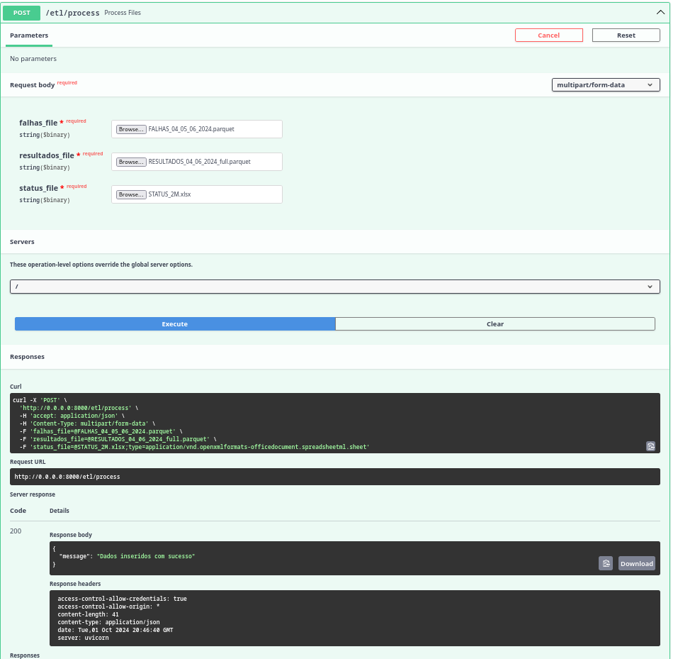

# ETL Process Endpoint Documentation

Este documento descreve o endpoint `/etl/process` utilizado para o processamento de arquivos ETL.

## Visão Geral

O proceso de 

## Endpoint

### POST `/etl/process`

**Descrição:** Processa e insere arquivos de dados no banco de dados, preparando-os para o treinamento de modelos.

**Parâmetros de Entrada:**
- `falhas_file`: Arquivo contendo dados de falhas (aceita formatos CSV, XLSX, JSON, Parquet, TXT).
- `resultados_file`: Arquivo contendo os resultados (aceita formatos CSV, XLSX, JSON, Parquet, TXT).
- `status_file`: Arquivo contendo informações de status (aceita formatos CSV, XLSX, JSON, Parquet, TXT).

**Resposta:**
- **Código 200**: Indica que os dados foram inseridos com sucesso.

