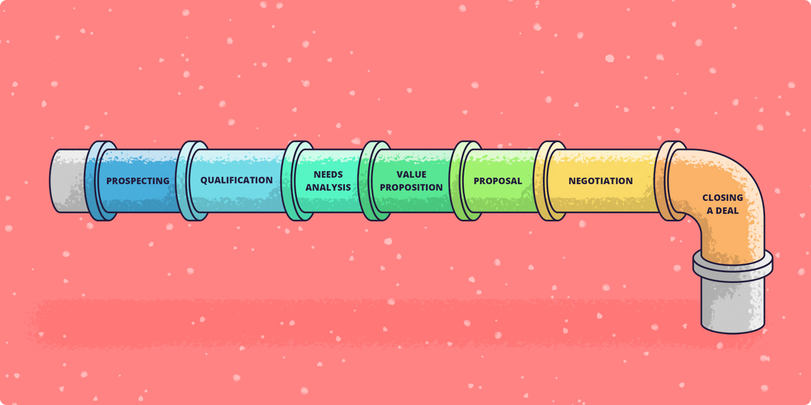

# Processo de Pipeline

## Importância do Pipeline no Projeto 

No projeto de predição de falhas, o processo de Pipeline é essencial para garantir que os dados coletados durante a linha de produção sejam continuamente utilizados para melhorar o modelo preditivo. Ao capturar e processar os dados em tempo real, o Pipeline assegura que informações valiosas sejam sempre acessíveis para análises e treinamentos de modelos futuros, permitindo ajustes e inovações constantes.

# O que é uma Pipeline em Programação

Uma Pipeline em programação é uma sequência estruturada de processos que transformam dados de entrada em resultados finais. Ela é comumente usada em contextos de processamento de dados, aprendizado de máquina e desenvolvimento de software, permitindo que cada etapa do processo seja tratada de forma modular e reutilizável. O uso de pipelines facilita a automação, a manutenção do código e a escalabilidade de projetos complexos.

## Importância das Pipelines

As Pipelines são essenciais porque:

- **Organizam o Fluxo de Dados**: Elas dividem tarefas complexas em etapas menores, facilitando o gerenciamento.
- **Melhoram a Reutilização**: Funções e componentes podem ser reutilizados em diferentes partes do projeto.
- **Facilitam Testes e Manutenção**: Cada etapa pode ser testada individualmente, tornando a identificação de bugs mais eficiente.

## Como Funciona o Processo de Pipeline no Projeto (Modelo)

No projeto de predição de falhas, o Pipeline em questão vai envolver diversar funções e passos(rotas) que vão servir para mostrarmos o modelo que já estamos utilizando para predizer e colocaremos a disposição o modelo novo que obtivemos com a nossa Pipeline:

### Fases do Processo de Pipeline (Modelo)

1. **Coleta de Dados:**
   - Captura de dados de diferentes fontes, como bancos de dados, APIs ou sistemas de monitoramento.

2. **Pré-processamento:**
    - Limpeza dos dados, tratamento de valores ausentes, e formatação para garantir a qualidade dos dados.

3. **Transformação:**
    - Aplicação de transformações, como normalização, extração de features, ou agregações, para preparar os dados para análise.

4. **Treinamento do Modelo:**
        Utilização dos dados processados para treinar modelos de machine learning, ajustando parâmetros conforme necessário.

5. **Avaliação do Modelo:**
    - Teste do modelo usando conjuntos de dados de validação para verificar a precisão e ajustar conforme as métricas de desempenho.

6. **Implantação:**
    - Colocação do modelo em um ambiente de produção, onde ele pode ser acessado e utilizado em tempo real.

7. **Monitoramento e Manutenção:**
    - Acompanhamento do desempenho do modelo em produção, coleta de novos dados e retraining do modelo conforme necessário para garantir a eficácia contínua.

Essas fases ajudam a garantir que o Pipeline seja eficiente e adaptável ao longo do tempo.

## Rotas e funções para a Pipeline (Modelo)

## Processo de Pipeline no Frontend (Modelo)

O processo de Pipeline do modelo no projeto também conta com uma interface simples e intuitiva no frontend. As páginas permitem que o usuário salve os novos modelos que o pipeline gerou, a visualização dos modelos que estão salvos no bucket do datalake (MINIO) e a escolha de qual modelo usar através das métricas dispostas.

### (Contar sobre o Pipeline na parte do Front)

### Verificação dos Modelos

Após a adição de novos dados, o usuário tem a opção de criar um novo modelo de predição, treinado com as informações recém-carregadas. Dessa forma, tem-se a opção de validar os dois modelos, o que foi gerado a partir dessa pipeline desenvolvida para a aplicação e o modelo ja em uso. A decisão vai ser exclusiva do usuário para escolher se vai utilizar o novo modelo ou se vai continuar com o modelo que ja está sendo usado.

## Conclusão
