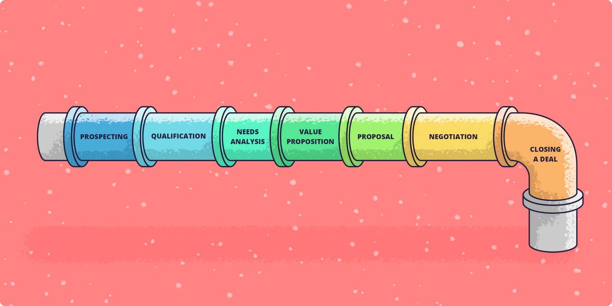

# Processo de Pipeline

## Importância do Pipeline no Projeto 

No projeto de predição de falhas, o processo de Pipeline é essencial para garantir que os dados coletados durante a linha de produção sejam continuamente utilizados para melhorar o modelo preditivo. Ao capturar e processar os dados em tempo real, o Pipeline assegura que informações valiosas sejam sempre acessíveis para análises e treinamentos de modelos futuros, permitindo ajustes e inovações constantes.

# O que é uma Pipeline em Programação

Uma Pipeline em programação é uma sequência estruturada de processos que transformam dados de entrada em resultados finais. Ela é comumente usada em contextos de processamento de dados, aprendizado de máquina e desenvolvimento de software, permitindo que cada etapa do processo seja tratada de forma modular e reutilizável. O uso de pipelines facilita a automação, a manutenção do código e a escalabilidade de projetos complexos.

## Importância das Pipelines

As Pipelines são essenciais porque:

- **Organizam o Fluxo de Dados**: Elas dividem tarefas complexas em etapas menores, facilitando o gerenciamento.
- **Melhoram a Reutilização**: Funções e componentes podem ser reutilizados em diferentes partes do projeto.
- **Facilitam Testes e Manutenção**: Cada etapa pode ser testada individualmente, tornando a identificação de bugs mais eficiente.



## Como Funciona o Processo de Pipeline no Projeto (Modelo)

No projeto de predição de falhas, o Pipeline em questão vai envolver diversar funções e passos(rotas) que vão servir para mostrarmos o modelo que já estamos utilizando para predizer e colocaremos a disposição o modelo novo que obtivemos com a nossa Pipeline:

### Fases do Processo de Pipeline (Modelo)

1. **Coleta de Dados:**
   - Captura de dados de diferentes fontes, como bancos de dados, APIs ou sistemas de monitoramento.

2. **Pré-processamento:**
    - Limpeza dos dados, tratamento de valores ausentes, e formatação para garantir a qualidade dos dados.

3. **Transformação:**
    - Aplicação de transformações, como normalização, extração de features, ou agregações, para preparar os dados para análise.

4. **Treinamento do Modelo:**
        Utilização dos dados processados para treinar modelos de machine learning, ajustando parâmetros conforme necessário.

5. **Avaliação do Modelo:**
    - Teste do modelo usando conjuntos de dados de validação para verificar a precisão e ajustar conforme as métricas de desempenho.

6. **Implantação:**
    - Colocação do modelo em um ambiente de produção, onde ele pode ser acessado e utilizado em tempo real.

7. **Monitoramento e Manutenção:**
    - Acompanhamento do desempenho do modelo em produção, coleta de novos dados e retraining do modelo conforme necessário para garantir a eficácia contínua.

Essas fases ajudam a garantir que o Pipeline seja eficiente e adaptável ao longo do tempo.

## Rotas e funções para a Pipeline (Modelo)

As rotas feitas no backend para que pudessemos usar em relação ao salvamento dos novos modelos partindo do pipeline introduzido estão descritos abaixo: 

```bash
@router.post("/createModel/")
## RECEBER METRICAS E O ARQUIVO PKL
async def get_model(precisao: float):
 # função no services/model 
    return create_model_by_id(precisao)
```
E a função principal que utlizamos nessa rota principal é a "create_model_by_id" que, de fato, faz a criação do modelo, salva no bucket do supabase e destaca o **ID** onde vamos utilizar para evidenciar qual modelo estamos usando e com qual vamos comparar:

```bash
def create_model_by_id(precisao: float):
    ## add o parametro do modelo (pkl) e data
    # função que insere o pkl no bucket e retorna o id do bucket
    # insere as metricas + id do bucket na tabela do supabase
    data = insert_table('Modelo', {"DATA_TREINO": datetime.now, "PRECISAO": precisao})
    parsed_data = parse_halle_times(data)
    print(data)
    for entry in parsed_data:
        id = entry['ID_MODELO']
        entry['DATA_TREINO'] = {item['ID_MODELO']: item['DATA_TREINO'] for item in data}.get(id, None)
        entry['PRECISAO'] = {item['ID_MODELO']: item['PRECISAO'] for item in data}.get(id, None)
    return parsed_data
```
Nessa rota a seguir, utilizamos para poder pegar o modelo salvo no bucket atráves do **ID**

```bash
@router.get("/getModel/")
async def get_model(ID_MODELO: int):
    return get_model_by_id(ID_MODELO: int)
```

A função referente é a "get_model_by_id" que identifica o modelo com base no **ID** colocado e trás para o usuário:

```bash
def get_model_by_id():
    data = get_by_id('Modelo', 'ID_MODELO,DATA_TREINO,PRECISAO')
    print(data)
    return data
```

## Processo de Pipeline no Frontend (Modelo)


O processo de Pipeline do modelo no projeto também conta com uma interface simples e intuitiva no frontend. As páginas permitem que o usuário salve os novos modelos que o pipeline gerou, a visualização dos modelos que estão salvos no bucket do datalake (SUPABASE) e a escolha de qual modelo usar através das métricas dispostas.

### (Contar sobre o Pipeline na parte do Front)

O processo de Pipeline no frontend foi feito pensando que o usuário não apenas monitore a evolução dos modelos, mas também crie novos modelos preditivos de maneira simples. No topo da página de histórico de modelos, há uma seção que exibe a métrica de precisão do modelo atual, permitindo que os usuários acompanhem o desempenho do modelo mais recente de forma clara e objetiva. Ao lado, temos o botão "Criar Novo Modelo" para criar novos modelos preditivos, que ativarão o pipeline de treinamento para o novo modelo. Logo abaixo, tem uma tabela que organiza os modelos já criados, mostrando informações como a data de criação, quantidade de carros considerados no treino, o nome do modelo e as métricas de desempenho desses modelos. 

### Verificação dos Modelos

Após a adição de novos dados, o usuário tem a opção de criar um novo modelo de predição, treinado com as informações recém-carregadas. Dessa forma, tem-se a opção de validar os dois modelos, o que foi gerado a partir dessa pipeline desenvolvida para a aplicação e o modelo ja em uso. A decisão vai ser exclusiva do usuário para escolher se vai utilizar o novo modelo ou se vai continuar com o modelo que ja está sendo usado.

## Conclusão
